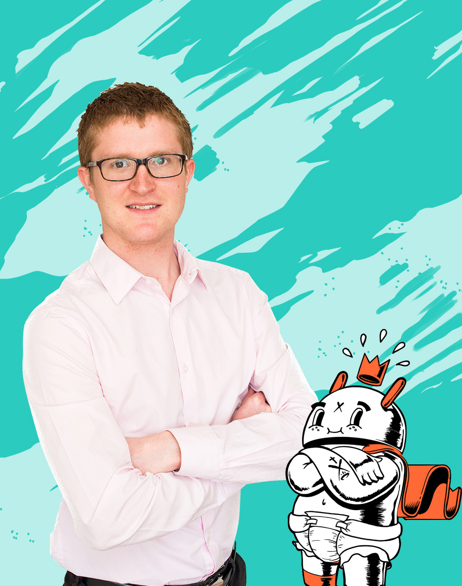
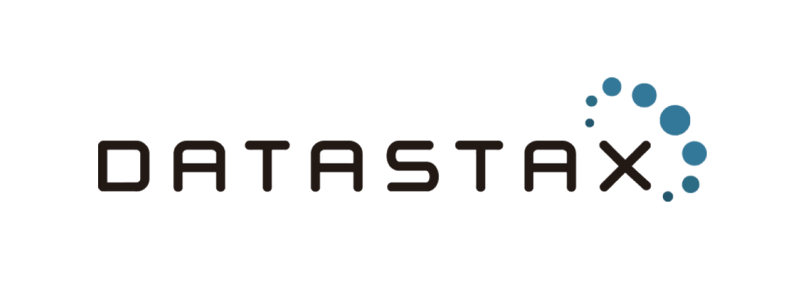
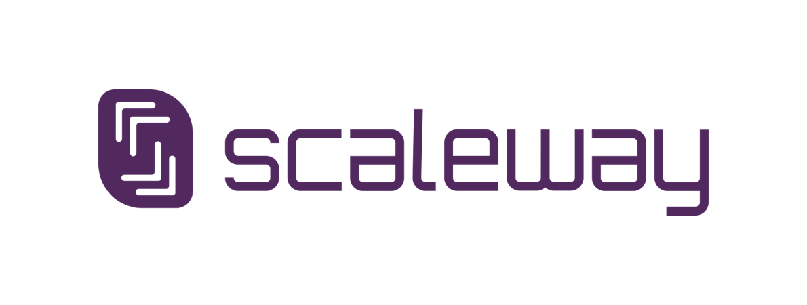

theme: XebiCon19
slidenumbers: true

# Management - Rex People Centric

---

[.header: #595959, alignment(left), line-height(1), Oswald]

# Qui sommes-nous ?

Benjamin *Lacroix*
@benjlacroix
Développeur

--- 

[.header: #595959, alignment(left), line-height(1), Oswald]

# Qui sommes-nous ?

Julien *Smadja*
@jsmadja
Développeur

---

[.header: #595959, alignment(left), line-height(1), Oswald]

# Plan

- WHY : Pourquoi est-ce un enjeu ?
- HOW : Comment l'implémenter en entreprise (l'exemple Xebia)
- WHAT : Nos pratiques

---

# WHY : Pourquoi est-ce un enjeu ?

## Les gens d'abord

- les arrivées et les départs
- 

---

[.header: #595959, alignment(left), line-height(1), Oswald]

# HOW

Blah

---

Blah

---

# WHAT

---

# Conclusion

---

[.text: #595959, alignment(center), Nunito]
[.text-strong: #fe414d]
[.header: #fe414d]

# [fit] XEBICON**19**

La vidéo de cette conférence
sera prochainement sur **xebicon.fr**

Pour en être informé, restez connecté à **@Xebiconfr**

*Merci à nos sponsors*

  
