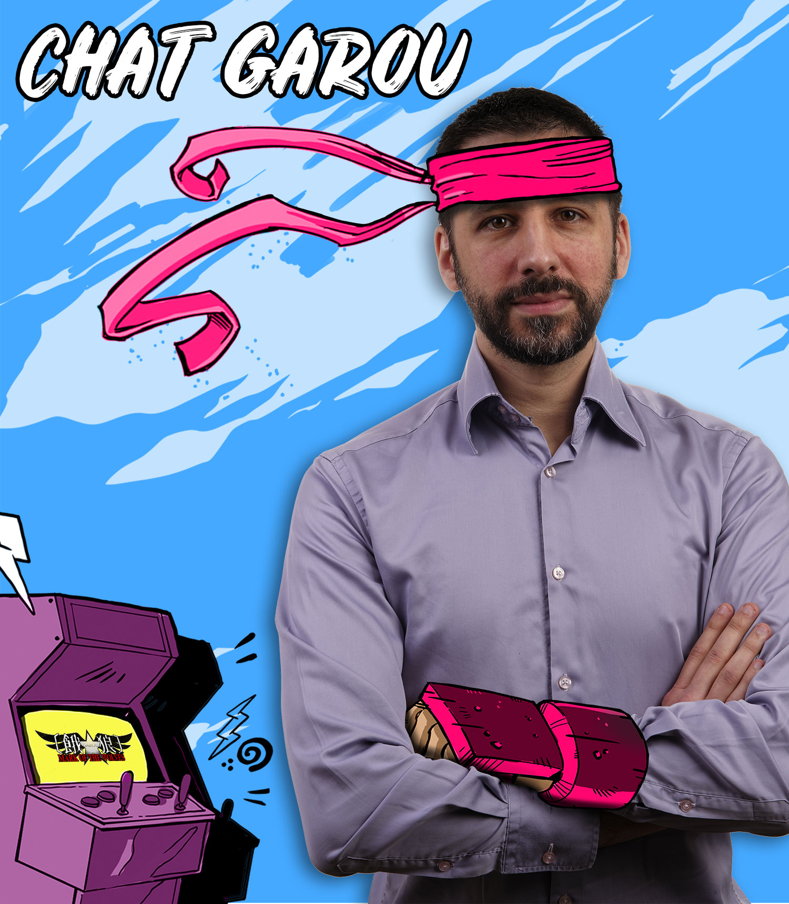

theme: XebiCon19
slidenumbers: true
slide-dividers: #

# Management - Rex People Centric

[.header: #FEFEFE, alignment(center), line-height(1), Oswald]
[.slidenumbers: false]
[.footer-style: #FEFEFE, alignment(right)]
[.footer: XebiCon19 | @XebiConFr | #XebiCon19]

# Qui sommes-nous ?

*Benjamin* Lacroix
Développeur fullstack
6 ans à Xebia

[.footer-style: #FEFEFE, alignment(left)]
[.footer: @benjlacroix]

# Qui sommes-nous ?

*Julien* Smadja
Développeur fullstack
9 ans à Xebia

[.footer: @jsmadja]
[.footer-style: #FEFEFE, alignment(right)]
[.slidenumbers: false]

# Plan

- Pourquoi le Management est un sujet à part entière dans une entreprise et pourquoi nous qu'il devient impératif de s'y pencher sérieusement
- Comment nous avons choisi, chez Xebia, de bouleverser notre façon de faire à plusieurs moments clés de notre existence
- Les outils que nous avons appliqués, façonnés et enseignés au cours de ces dernières années, nous vous les donnons

# Pourquoi le Management est un sujet à part entière dans une entreprise et pourquoi nous qu'il devient impératif de s'y pencher sérieusement

## Au tout début

Toute entreprise a un système de management, qu'elle soit petite, avec quelques employés ou un gros groupe de plusieurs dizaines de milliers de collaborateurs. L'histoire que nous allons vous rencontrer c'est celle de Xebia, une entreprise de quelques dizaines de collaborateurs, plutôt jeune, une trentaine d'années pour la plupart. Ces collaborateurs travaillent chez des clients, sur des projets informatiques, dans Paris ou sa proche banlieue. Autant vous dire que pour créer un sentiment d'appartenance il faut se lever tôt. Mais au départ, quand on est peu, c'est facile, on connait tout le monde, on crée des liens facilement et puis, il n'y a en général qu'un seul chef, c'est d'ailleurs sans doute lui qui nous a recruté.
Il semble alors assez facile d'exister au sein de l'entreprise, nous sommes, individuellement vu et reconnu, on nous accorde du temps, on nous donne des conseils.

## Les besoins

- être connu et reconnu : J'existe
- être écouté : Mes problèmes
- connaitre le sens de son action : Je sais pourquoi je me lève le matin

# Comment nous avons choisi, chez Xebia, de bouleverser notre façon de faire à plusieurs moments clés de notre existence

## Historique rapide

### Epoque I - 2004
Problème : Tout se passe bien jusqu'au moment où l'entreprise grandit et que le manageur historique, celui qui s'occupait de tous ne peut plus assurer un suivi de qualité. Il est alors temps de déléguer.

Solution => Epoque II

### Epoque II - pré-2011
La première réponse de Xebia a été de nommer des manageurs, mais pas n'importe lesquels. Les manageurs chez Xebia sont des consultants avec une **rôle** de Manageur, c'est-à-dire que leur métier est avant d'être consultant, d'être par exemple Développeur sur le projet d'un de nos clients et qu'il a **en plus** une responsabilité d'encadrement de collaborateurs qui, je le rappelle, ne sont pas forcément à ses côtés.

La deuxième chose, c'est que ces manageurs auront la responsable d'au maximum 12 collaborateurs, 12 consultants, répartis aux 4 coins de Paris.

Le dernier point, est un conseil, "managez avec vos trippes". Je crois que c'est à peu près la seule formation que nos nouveaux manageurs auront reçu. Allez, sautez dans le grand bain et nagez.

A votre avis, que s'est-il passé ?

Problème :
- pas de formation
- pas de méthode
- pas de vocabulaire commun
- pas d'harmonisation des façons de faire
- pas de rythme, chacun fait comme il veut / comme il le sent
- pas de temps pour bien faire, 12 managés, on le rappelle, avec une mission à temps plein

Solution => Epoque III

### Epoque III - mi-2015

En 2015, nous choisissons de professionnaliser notre management, nous faisons appel au cabinet Madinier pour avoir un avis extérieur, des conseils et surtout, une formation au management, c'est-à-dire aux outils qui nous permettront d'être de bons manageurs.

Ce qui est mis en place :
- Nous passons d'un groupe de 12 à 7 managés
- Nous nous imposons un rythme de suivi en one to one toutes les 6 semaines : nous appelons cela le point feedback
- Nous instaurons un rythme mensuel pour le Management Meeting, avec un ODJ préparé à l'avance 

Problème : 
- Nomination de nouveaux manageurs impliquent la création de Manageurs de Manageurs
- Problèmes lors des réévaluations de salaires
- Une strate supplémentaire dans une hiérarchie qu'on souhaite la plus plate possible

Solution => Epoque IV

### Epoque IV - 2018

Ce qui est mis en place :
- Le management devient un des pilliers officiels de Xebian avec un investissement à temps complet d'un Manageur de manageurs, chargé d'accompagner l'ensemble des consultants manageurs

Avantages :
- Une cohérence sur l'accompagnement des manageurs
- Une possibilité de donner de l'information à tous, en one to one
- Une expérience de Manageur Senior apportée à tous
- Un accompagnateur dans les moments difficiles

Problème qu'on voit venir ... :
- Ca ne scale pas, retour à l'époque I :'-(

### Conclusion de la partie 2
La structure du management doit se réinventer, sans cesse, à chaque pallier. Pour nous, c'est principalement le nombre de consultants qui rejoignent nos rangs qui nous poussent à nous remettre en question. Mais c'est aussi les raisons des départs, qui sont souvent difficiles à identifier. Ne dit-on pas qu'on quitte une entreprise avant tout à cause de son manageur plutôt qu'à cause du salaire ?

`According to many sources, a bad boss is also the number one reason why employees quit their job. Here's how to get along with your boss.` [source](https://www.thebalancecareers.com/top-reasons-why-employees-quit-their-job-1918985) : 

Alors ce "boss", ce manageur dans notre cas, il doit faire quoi exactement pour retenir ses collaborateurs ?

# Les outils que nous avons appliqués, façonnés et enseignés au cours de ces dernières années, nous vous les donnons

Alors concrètement, que fait-on ? 

## La culture du feedback

## Les moyens
- une communauté
- une formation initiale
- une formation continue
- un accompagnement
- des canaux de communication
- de la documentation

## Le Point Feedback

Le Point Feedback est un outil, c'est une rencontre, régulière entre un manageur et un managé. Ce moment il est important, pour porter de l'attention, pour donner et obtenir un regard sur son activité, de façon bidirectionnelle.
Le format classique consiste à aborder le déroulement de la mission du Xebian, les activités hors mission, appelées contributions, telles que la rédaction d'articles pour le Blog, la préparation de slots XKE ou de slots pour la Xebicon. Il est aussi le moment propice pour dire. Donner des félicitations, des encouragements mais aussi pour recadrer, conseiller, ou tout simplement écouter activement.
Ces points feedbacks nous les souhaitons régulier, espacés de 6 semaines. Dans un cadre formel ou informel. Formel, c'est à dire dans un bureau, au calme, pour préserver l'intimité, informel comme au restaurant, le temps d'un déjeuner, c'est bruyant, mais une rencontre régulière est importante pour créer un lien fort de proximité.

Pour varier le format, nous avons créé au fil des ans différentes variantes, comme le Perfect Match par exemple. Nous allons dérouler devant  cet outil dont nous sommes très fiers. Il s'agit de faire noter le Xebian plusieurs critères. 

## Le Perfect Match

Benjamin : le manageur
Julien : le managé

Exemple de dialogue

BLA - "Bonjour Julien"
JSM - "Bonjour Benjamin"

BLA - "Je te propose de faire le Perfect Match, comme d'habitude, tu notes de 1 à 5 les critères, 1 étant négatif/inquiétant, 5 était l'idéal, une situation qui te convient. 3 c'est moyen/neutre."

### DDD
BLA - "Tu as démarré ta mission il y a presque 7 mois"

### TDT
Message à faire passer : Prendre soin de ses managés c'est aussi s'intéresser au nombre d'heure passés dans les transports

BLA - "Comment tu évalues ton temps de transport ?"

JSM - "Je dirai 4/5, je mets 55mn de chez moi, quand on habite en banlieue parisienne c'est difficile de faire beaucoup moins, mais je suis assis dans le RER donc ça va"

BLA - pas de réponse, rien de spécial à dire je pense

### HSK
HSK => Faire Grandir techniquement

BLA - "Au niveau des Hard Skills ?"

JSM - "Ca va, mais maintenant que la stack technique est en place je n'apprends plus forcément, je dirai 3"

BLA - 

1. L'avenir sur la mission ? (va répondre, que des pages à dérouler)
2. OK, tu t'ennuies ? (oui, non, je ne suis pas sur)
3. Utiliser tes connaissances et les partager ? (oui, mais non, nouveau challenge technique)
4. Connais-tu les projets internes ? Conf Companion (mobile) ; Skills (web) ; XQRCode (React Native) ; XDD (Xebian as a service) -> OK, why not, on en parle après.

### SSK
SSK => Faire Grandir non-techniquement

BLA - "Par rapport aux Soft Skills ?"

JSM - "Je ne sais pas trop comment mettre ça en pratique"

BLA - "Ta dernière formation portait sur la présentation orale"

JSM - "Oui mais je ne fais pas de présentation, je ne vois pas comment travailler ça"

BLA - "J'imagine que tu fais des Daily Standup, tu peux mettre en pratique ce que tu as vu en formation par exemple. Préparer ton discours, savoir quel message tu veux faire passer, balayer les gens du regard, travailler ta posture, ta voix, ton intonnation."

JSM - "Oui tu as raison, je n'y avais pas pensé. Du coup, je mets 3 sur 5, et la prochaine fois j'espère que je mettrai 4 ou 5 si je sens que j'ai pu progresser là dessus."

### IPC
IPC => Il sait pourquoi il travaille chez le client

BLA : "Ok, IPC, ton intérêt pour le Client ou le sujet de ta mission"

JSM : "5, sans hésitation, c'est un domaine fonctionnel qui me plait vraiment, je sais que c'est rare de trouver une correspondance, mais là le sujet me plait personnellement et en plus on m'a bien expliqué à quoi servait l'appli, on est en contact avec les utilisateurs, c'est top."

### LAX
LAX => Il sait avec qui il travaille et crée des liens avec autrui, pas seulement sur sa mission

BLA : "Tu es arrivé il y a 7 mois, comment tu évalues la qualité du lien avec les Xebians"

JSM : "Je suis le seul Xebian dans ma mission, mais comme on se voit au XKE chaque mois et que les Xebians sont très actif sur Slack, ça va, je mets 4. Aussi, on se voit régulièrement et tu me communiques des informations, c'est cool."

### ASX
ASX => Il sait pourquoi il travaille chez Xebia

BLA : "Est-ce la stratégie de Xebia te semble claire ?"

JSM : "Oui assez, déjà parce que quand j'ai une question tu sais y répondre, je reçois régulièrement des mails des Technical Officers de Xebia alors je sais sur quoi on travaille technologiquement et il y a le Marketing qui nous parle des événements qu'on organise comme la Xebicon de novembre. Disons que je mets 4 !"

## Récapitulatif

| Critère | Note |
|---------|------|
|DDD      |7 mois|
|TDT      |4     |
|HSK      |3     |
|SSK      |3     |
|IPC      |5     |
|LAX      |4     |
|ASX      |4     |

### Explication

Vous venez d'assister à un exemple de Perfect Match, chaque cas est différent. Au delà de la notation, qui pourrait se faire via un formulaire en ligne, ce qui nous importe c'est que ça ouvre la discussion sur des sujets qui n'auraient pas forcément été abordés autrement. Se demander si on progresse, si on aime sa mission, si on se sent bien dans sa propre entreprise, pouvoir en parler naturellement est le vrai gros plus du Perfect Match à titre individuel.

### Synthèse

Mais nous nous servons du Perfect Match également comme une synthèse générale, en faisant la moyenne de toutes les notes, critère par critère, mission par mission. Et tout ça, à chaque trimestre. Nous pouvons ainsi sentir le poul de la société, apporter des améliorations et savoir comment les Xebians se sentent.  Pour obtenir cela, les manageurs reportent les notes et les commentaires dans un grand tableau.

## La communauté de manageur

Pour développer ce type d'outil, nous nous appuyons sur une communauté de manageurs. Cette communauté se voit tous les mois, une demi-journée, construite autour d'un ordre du jour. Les ODJ changent chaque mois, ils évoluent en fonction des sujets à traiter. Regardons ensemble quelques exemples.

### La descente d’informations
En tant que manageur il est important d’avoir une vision plus large de l’entreprise, d’en comprendre les rouages souvent invisibles (mais pas cachés). Ainsi, nous pouvons proposer des séances d’informations sur l’activité du Commerce (un état des lieux de nos missions, des nouveaux clients, de l’état de la facturation), les axes Marketing (les événements à venir et comment les manageurs peuvent servir de relais), comprendre le modèle économique de la société …

### Les ateliers pratiques
Pour être bon, pour être prêt, pour combattre la peur, il faut pratiquer, pratiquer, pratiquer. Le rôle du manageur implique d’être confronté à des situations plus ou moins agréables. La façon dont un manageur réagit aura une incidence majeure sur la suite de sa relation avec son managé, avec une équipe, avec des clients. Se préparer au pire, apprendre à choisir ses mots, le ton, choisir le bon moment, ne sont pas des compétences innées.
Le Management Meeting est un moment propice à la mise en situation. Au fil des années nous avons pu lister bon nombre de situations (un collaborateur qui sort du cadre, un conflit entre des collaborateurs et un de nos clients, annoncer une réévaluation de salaire qui pourrait être perçue comme décevante). S'entraîner dans un cadre bienveillant permet de mettre un maximum de chance de son côté, d’apprendre de ses erreurs et éviter le pire.

### Le Brainstorming
Nous croyons en l’intelligence collective. Quand on devient manageur et qu’on comprend qu’une nouvelle responsabilité nous incombe, on est tenté de résoudre tous les problèmes qu’on rencontre, mais les solutions ne sont jamais évidentes une fois passé de “l’autre côté”. En faisant partie d’une communauté, on sait qu’on peut bénéficier du cerveau des autres, confronter nos idées aux réticences ou à l’expérience d’autrui. Les sujets à aborder ensemble concernent à la fois les process internes, les initiatives pour améliorer le confort, l’équilibre de vie, la façon de récompenser les collaborateurs, la communication interne ou externe. Le Management Meeting est alors l’endroit idéal pour apporter un sujet, en discuter, s’accorder sur une solution et la tester. Les mois qui passent permettront d’en tirer des leçons, et même si c’est un échec, nous aurons avancé.

### De nouvelles idées
Être plus nombreux, c’est aussi avoir plus d’idées. Bien sûr, on n’échappera pas à des idées proposées par de nouveaux manageurs qui auront déjà été débattues voire testées et abandonnées. Pour autant, il est toujours important de les reconsidérer, soit pour expliquer pourquoi elles n’ont pas abouties, soit pour peut-être retenter l’initiative, avec un manageur débordant d’énergie. Il se peut que la forme n’était pas bonne et que cette fois-ci ça marchera.
Il n’est pas acceptable de balayer d’un revers de main les idées sans donner d’explications.

### L’entraide
Il arrive parfois qu’en tant que manageur nous soyons dans une situation de blocage face à un managé. Sans forcément parler de conflit, il arrive qu’on soit à court d’idée pour faire grandir l’autre ou comprendre ce qui bloque la relation. Dans ce cas, un manageur peut librement exprimer son désarroi au Management Meeting, sans avoir peur d’être jugé. C’est ce qui est arrivé, et c’est tout naturellement qu’un autre manageur s’est porté volontaire pour assister à un des points feedbacks entre le manageur demandeur et son managé : une opportunité pour tous d’améliorer la situation.
La formation
En formant régulièrement les manageurs à nos pratiques (savoir donner un feedback, résoudre un conflit, pratiquer l’écoute active), nous formons autant de nouveaux formateurs, aptes à animer les formations de leurs tous jeunes pairs.

### La FAQ

C'est tout bête une FAQ, mais ça permet de garder une trace des décisions prises, des process. Vous en avez une ?

[PHOTO]

# Conclusion

# Take Away

# [fit] XEBICON**19**

[.text: #595959, alignment(center), Nunito]
[.text-strong: #fe414d]
[.header: #fe414d]

La vidéo de cette conférence
sera prochainement sur **xebicon.fr**

Pour en être informé, restez connecté à **@Xebiconfr**

Merci à nos sponsors

  
